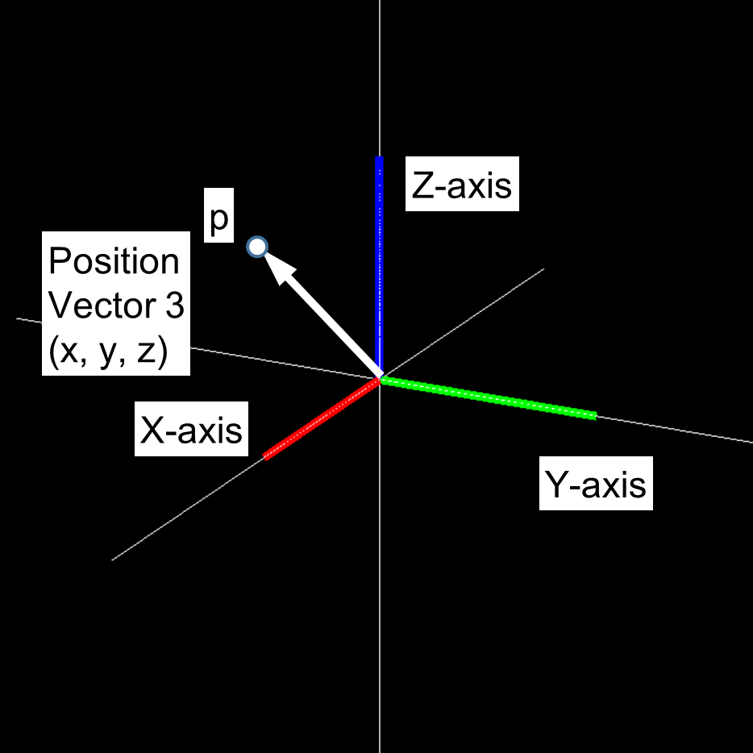
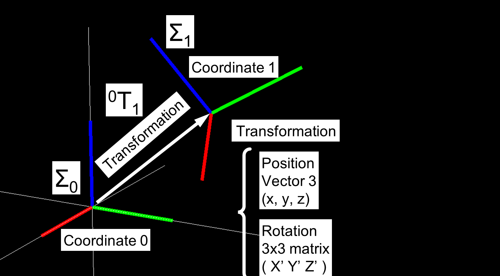
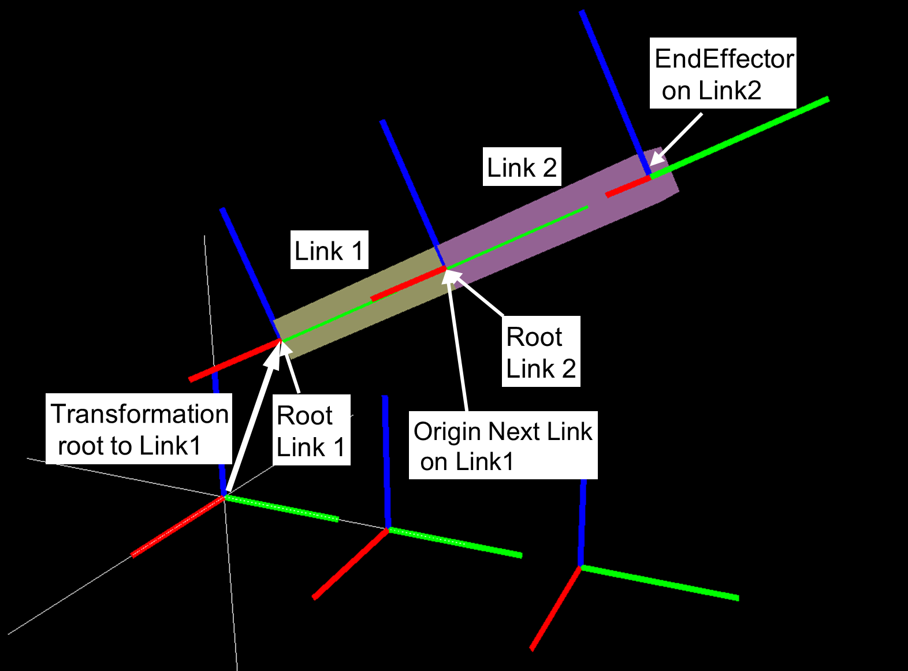

===========
Coordinates
===========

**************************
Coordinate Transformations
**************************

^^^^^^^^^^^
3D Position
^^^^^^^^^^^

The 3D position is a vector of three real numbers, represented using lower-case boldface letters.

The three elements represent positions on the x-, y-, and z-axis, respectively.

It is often denoted as a vertical vector.

3D position :math:`\mathbf{p}` is denoted below.

.. math::
   \mathbf{p} = [ \; x, \; y, \; z \;]^{T}

^^^^^^^^^^^
3D Rotation
^^^^^^^^^^^

Rotations in 3D can be represented using a rotation matrix.

The rotation matrix is a 3x3 matrix.
It is the x-, y-, and z-axis of the rotated coordinate series aligned in columns,
as referenced from the original coordinate system.

Rotation matrix :math:`\mathbf{R}` is denoted below.

.. math::
   \mathbf{R} = [ \; \mathbf{x} \quad \mathbf{y} \quad \mathbf{z} \; ]

Rotation matrix is an orthogonal matrix, which means that the transpose and inverse of the matrix are equival

Inverse of a rotation matrix is denoted below.

.. math::
   \mathbf{R}^{-1} = \mathbf{R}^{T}

Other ways to represent 3D rotations are
Roll-Pitch-Yaw angle (RPY), Quaternion, AngleAxis, etc.

Although the degree of freedom (DOF) of rotation is 3,
a rotation matrix that is easy to use in calculations,
and a quaternion that has no singular points and is easy to interpolate are used.

Please refer to the reference book.

........................
AngleAxis representation
........................

^^^^^^^^^^^^^^^^^^^^^^^^^^^^^^^^^
Homogeneous transformation matrix
^^^^^^^^^^^^^^^^^^^^^^^^^^^^^^^^^

6DOF-Position in 3D can be represented using 3D position and 3D rotation,
with 3 DOF for position and 3 DOF for rotation,
for a total of 6 DOF.

The homogeneous transformation matrix
is used to represent 6DOF-Position in 3D.

The homogeneous transformation matrix T is represented as a 4x4 matrix
using a 3D position vector :math:`\mathbf{p}`
and a 3D rotation matrix :math:`\mathbf{R}` as follows.

.. math::
   T = \begin{pmatrix}
   \mathbf{R}  & \mathbf{p} \\
   \mathbf{0}  & 1
   \end{pmatrix}

The inverse matrix of T is as follows.

.. math::
   T^{-1} = \begin{pmatrix}
   \mathbf{R}^{-1}  & - \mathbf{R}^{-1}\mathbf{p} \\
   \mathbf{0}  & 1
   \end{pmatrix}

The multiplication of :math:`\mathbf{T}_{a}`
and :math:`\mathbf{T}_{b}` is as follows.

.. math::
   T_a \times T_b = \begin{pmatrix}
   \mathbf{R}_a\mathbf{R}_b  & \mathbf{R}_a\mathbf{p}_b  + \mathbf{p}_a \\
   \mathbf{0}  & 1
   \end{pmatrix}

where :math:`\mathbf{T}_{a}` and :math:`\mathbf{T}_{b}` are as follows.

.. math::
   T_a = \begin{pmatrix}
   \mathbf{R}_a  & \mathbf{p}_a \\
   \mathbf{0}  & 1
   \end{pmatrix}

.. math::
   T_b = \begin{pmatrix}
   \mathbf{R}_b  & \mathbf{p}_b \\
   \mathbf{0}  & 1
   \end{pmatrix}

^^^^^^^^^^^^^^^^^^^^^
System of coordinates
^^^^^^^^^^^^^^^^^^^^^

^^^^^^^^^^^^^^^^^^^^^^^^^^^^^^^^^^^^
Coordinate system of rigid body link
^^^^^^^^^^^^^^^^^^^^^^^^^^^^^^^^^^^^

.. image:: images/link_original.PNG

************************************************************
Relation between system of coordinates and coordinates class
************************************************************

coordinates class (cnoid.IRSLCoords.coordinates)
is a class for manipulating homogeneous transformation matrices.

An instance of the coordinates class has
3D position vector :math:`\mathbf{p}` and
3D rotation matrix :math:`\mathbf{R}` .

^^^^^^^^^^^^^^^^^^^^^^^^^^^^^^^^^^^^^^^^^^^^^^^^^^^^^^^^^^^^^^
Initializing and accessing to a position and a rotation matrix
^^^^^^^^^^^^^^^^^^^^^^^^^^^^^^^^^^^^^^^^^^^^^^^^^^^^^^^^^^^^^^

:math:`\mathbf{p}` and :math:`\mathbf{R}` can be retrieved
by accessing to properties of coordinates class.

In the following, T is an instance of the coordinates class.

Mathmatical representaion of T is following.

.. math::
   T = \begin{pmatrix}
   \mathbf{R}  & \mathbf{p} \\
   \mathbf{0}  & 1
   \end{pmatrix}

- Initalizing coordinates

.. code-block:: python

    >>> p = numpy.array([1, 2, 3])
    >>> R = numpy.array([[0, -1, 0],[1, 0, 0], [0, 0, 1]])
    >>> T = coordinates(v, R)
    >>> T
    <coordinates[address] 1 2 3 / 0 0 0.707107 0.707107 >
    >>> coordinates(p) ### set pos, rot is Identity
    >>> coordinates(R) ### set rot, pos is  Zero
    >>> coordinates(numpy.array([0, 0, 0, 1])) ### set rot by quaternion
    >>> coordinates(v, numpy.array([0, 0, 0, 1])) ### set pos and rot by quaternion
    >>> coordinates(numpy.array([[0, -1, 0, 0],[1, 0, 0, 0], [0, 0, 1, 0], [0, 0, 0, 1]]) ### 4x4 homogeneous transformation matrix

- Getting and setting 3D position (access attribute pos)

.. code-block:: python

    >>> T.pos
    array([1., 2., 3.])

- Getting and setting Rotation matrix (access attribute rot)

.. code-block:: python

    >>> T.rot
    array([[ 0., -1.,  0.],
           [ 1.,  0.,  0.],
           [ 0.,  0.,  1.]])

- Getting and setting quaternion (access attribute quaternion)

.. code-block:: python

    >>> T.quaternion
    array([0.        , 0.        , 0.70710678, 0.70710678])

- Getting and setting roll-pitch-yaw angle (access attribute RPY)

.. code-block:: python

    >>> T.RPY
    array([ 0.        , -0.        ,  1.57079633])

- Getting and setting angle-axis (access attribute angleAxis)

.. code-block:: python

    >>> T.angleAxis
    array([0.        , 0.        , 1.        , 1.57079633])

- Getting and setting 4x4 homogeneous transformation matrix (access attribute cnoidPosition)

.. code-block:: python

    >>> T.cnoidPosition
    array([[ 0., -1.,  0.,  1.],
           [ 1.,  0.,  0.,  2.],
           [ 0.,  0.,  1.,  3.],
           [ 0.,  0.,  0.,  1.]])

^^^^^^^^^^^^^^^^^^^^^^^^^^^
Methods to convert a vector
^^^^^^^^^^^^^^^^^^^^^^^^^^^

In the following,
:math:`\mathbf{v}` is 3D position vector (numpy.array).
Folowing 4 functions do not change the input value.

- Rotating vector

.. code-block:: python

    >>> v = numpy.array([0.1, 0.2, 0.3])
    >>> T.rotate_vector(v)
    array([-0.2,  0.1,  0.3])

Mathmatical representation of a return value is

:math:`\mathbf{R} \mathbf{v}`

- Rotating vector (inverse-rotation)

.. code-block:: python

    >>> T.inverse_rotate_vector(v)

Mathmatical representation of a return value is

:math:`\mathbf{v}^T \mathbf{R}`

- Transforming vector

Converts a vector represented in a local coordinate system T
to a vector represented in the world coordinate system.

.. code-block:: python

    >>> T.transform_vector(v)

Mathmatical representation of a return value is

:math:`\mathbf{R}\mathbf{v} + \mathbf{p}`

- Transforming vector(inverse-transformation)

Converts a vector represented in the world coordinate system.
to a vector represented in a local coordinate system T.

.. code-block:: python

    >>> T.inverse_transform_vector(v)

Mathmatical representation of a return value is

:math:`\mathbf{R}^{-1}\left( \mathbf{v} - \mathbf{p} \right)`

^^^^^^^^^^^^^^^^^^^^^^^^^^^^^^^^^^^^^^^^^^^^^^^
Methods to convert a vector(change input value)
^^^^^^^^^^^^^^^^^^^^^^^^^^^^^^^^^^^^^^^^^^^^^^^

There are functions which change the input value.

Input value v will be changed as the same of return value.

.. code-block:: python

    >>> v = numpy.array([0.1, 0.2, 0.3])
    >>> T.rotateVector(v)
    >>> T.inverseRotateVector(v)
    >>> T.transformVector(v)
    >>> T.inverseTransformVector(v)

^^^^^^^^^^^^^^^^^^^^^^^^^^^^^^^^^^^^^^^^^^^^^^^^^^^^^^^^^^
Methods to return a coordinate (without modifying itself)
^^^^^^^^^^^^^^^^^^^^^^^^^^^^^^^^^^^^^^^^^^^^^^^^^^^^^^^^^^

In the following, A is an instance of the coordinates class.

- Getting inverse-transformation

.. code-block:: python

    >>> T.inverse_transformation()

Returns inverse transformation.

Mathmatical representation of a return value is following.

.. math::
   T^{-1} = \begin{pmatrix}
   \mathbf{R}^{-1}  & - \mathbf{R}^{-1}\mathbf{p} \\
   \mathbf{0}  & 1
   \end{pmatrix}

- Getting transformation between coordinates

.. code-block:: python

    >>> T.transformation(A, wrt)

*wrt* is an optional value and defult value is 'local'

- If *wrt* = coordinates.wrt.local

:math:`T^{-1}A` is returned

- If *wrt* = coordinates.wrt.world

:math:`AT^{-1}` is returned

- If *wrt* = W (coordinates class)

:math:`W^{-1}AT^{-1}W` is returned

^^^^^^^^^^^^^^^^^^^^^^^^
Methods to modify itself
^^^^^^^^^^^^^^^^^^^^^^^^

In the following, :math:`\leftarrow` represents substitution.

- Setting new coordinates

.. code-block:: python

    >>> T.newcoords(A)

Attributes pos and rot is substituted

:math:`T \leftarrow A`

- Moving to new coordinates

.. code-block:: python

    >>> T.move_to(A, wrt)

- If *wrt* = coordinates.wrt.local

:math:`T \leftarrow TA`

- If *wrt* = coordinates.wrt.world

:math:`T \leftarrow A`

- If *wrt* = W (coordinates class)

:math:`T \leftarrow WA`

- Translating

.. code-block:: python

    >>> T.translate(v, wrt)

- If *wrt* = coordinates.wrt.local

:math:`\mathbf{p} \leftarrow \mathbf{p} + \mathbf{R}\mathbf{v}`

- If *wrt* = coordinates.wrt.world

:math:`\mathbf{p} \leftarrow \mathbf{p}+ \mathbf{v}`

- If *wrt* = W (coordinates class)

:math:`\mathbf{p} \leftarrow \mathbf{p} + \mathbf{R}_{W}\mathbf{v}`

:math:`\mathbf{R}_{W}` is rotation matrix of W

- Locating

.. code-block:: python

    >>> T.locate(v, wrt)

- If *wrt* = coordinates.wrt.local

:math:`\mathbf{p} \leftarrow \mathbf{p} + \mathbf{R} \mathbf{v}`

- If *wrt* = coordinates.wrt.world

:math:`\mathbf{p} \leftarrow \mathbf{v}`

- If *wrt* = W (coordinates class)

:math:`\mathbf{p} \leftarrow \mathbf{p}_{W} + \mathbf{R}_{W} \mathbf{v}`

:math:`\mathbf{R}_{W}` is rotation matrix of W, and :math:`\mathbf{p}_{W}` is 3D position of W.

- Transforming

.. code-block:: python

    >>> T.transform(A, wrt)

- If *wrt* = coordinates.wrt.local

:math:`T \leftarrow TA`

- If *wrt* = coordinates.wrt.world

:math:`T \leftarrow AT`

- If *wrt* = W (coordinates class)

:math:`T \leftarrow \left( W A W^{-1} \right) T`

^^^^^^^^
Examples
^^^^^^^^

**************
Reference book
**************

実践ロボット制御 https://www.ohmsha.co.jp/book/9784274224300/

第2章 姿勢の記述 及び 第4章 運動学の一般的表現 の内容が参考になる
